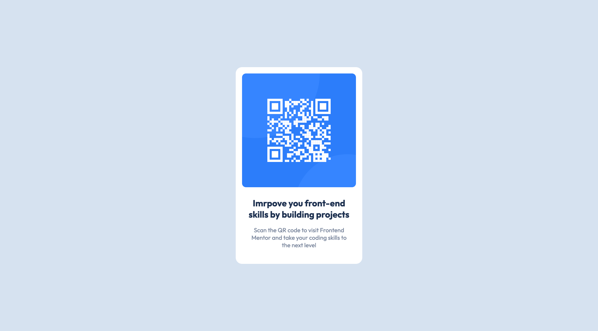

# Frontend Mentor - QR code component solution

This is a solution to the [QR code component challenge on Frontend Mentor](https://www.frontendmentor.io/challenges/qr-code-component-iux_sIO_H). Frontend Mentor challenges help you improve your coding skills by building realistic projects.

## Table of contents

- [Overview](#overview)
  - [Screenshot](#screenshot)
  - [Links](#links)
- [My process](#my-process)
  - [Built with](#built-with)
- [Author](#author)

## Overview

### Screenshot

### Links

- [Solution URL](https://www.frontendmentor.io/solutions/qr-code-component-Q6Q5_27ubU)
- [Live Site URL](https://qr-code-component-by-rakil.vercel.app)

## My process

### Built with

- HTML
- CSS
- Flexbox
- Vercel

## Author

- Website - [Rakil Ahmed](https://www.rakilahmed.com)
- Frontend Mentor - [@rakilahmed](https://www.frontendmentor.io/profile/rakilahmed)
